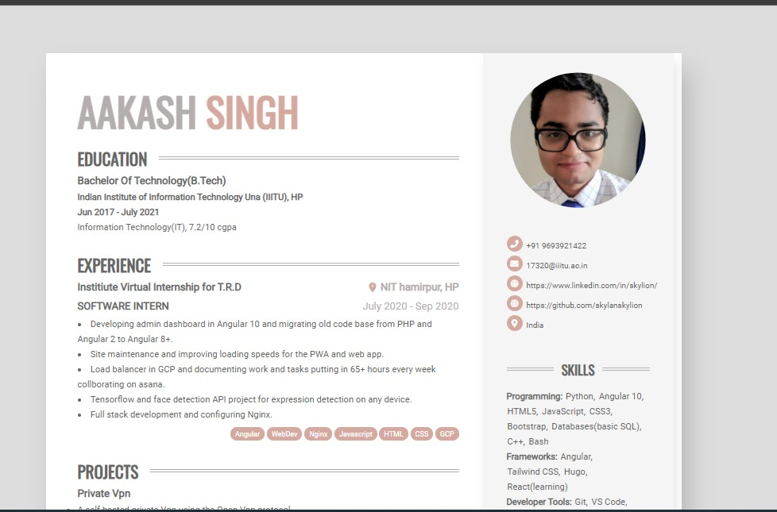

# Almeida CV Theme
Theme to build a customizeable printable HTML/CSS CV.



# Features
 - Online CV with minor responsiveness
 - Printable as A4 PDF
 - HTML5 + CSS3
 - Customizeable colors

## Print your PDF CV
When printing the page in the browser, you'll get a formatted A4 page that can be used as your PDF resume. 
If your page holds more than 1 A4 page, the content will be divided into the given amount of pages.

For better formatting, you can set the number of pages in the `config.toml` file.

If badges and other elements with background don't render correctly, remember to toggle the "Background Graphics" option in the print dialog.

# Download 
Clone the repo: `git clone https://github.com/ineesalmeida/almeida-cv`

# Installation
## Install Hugo (Extended)
To use almeida-cv theme you need to install Hugo Extended by following https://gohugo.io/getting-started/installing/.

## Create your personal website and run
```
hugo new site <your website's name>
cd <your website's name>/themes/
```
Clone the theme (`git clone https://github.com/ineesalmeida/almeida-cv`) into your themes folder.
Replace the files in your root's directory with the ones on `themes/almeida-cv/exampleSite`.
```
hugo server -D
```
The theme is alive on http://localhost:1313/.

## Customization
You can change the theme colors and number of pages in the `config.toml` file.
Your professional data should be added in the `data/content.yaml`.


# Building 
To generate your site in the public folder, execute the following:
```
hugo
```
within the root of your project.

# Hosting
To host the site go to your public folder and change all the links with https://example.com/ to ./ i.e relative links. Now copy all contents of public folder and create a new docs folder in root directory and paste the contents. Now go to github pages and serve the site from master branch and docs/ folder. Your site should be up! https://skylanskylion.github.io/aakashcv/

# Contributing 
Post bugs and contributions to the issue tracker. Or make a pull request.
